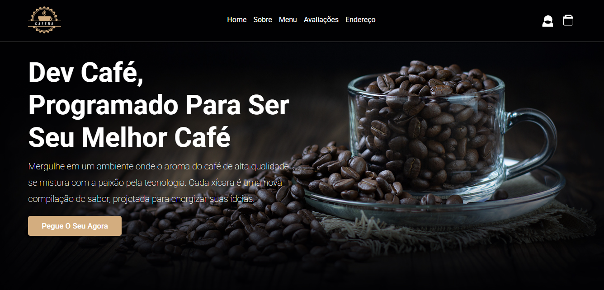

# Landing Page "Dev Café Semântico"

  
  

## 🚀 Demo Online

Você pode testar a landing page ao vivo aqui:
**[https://dgsilvino.github.io/DevCafeSemantico/](https://dgsilvino.github.io/DevCafeSemantico/)**

## ☕ Visão Geral

Este projeto é uma landing page moderna e totalmente responsiva para uma cafeteria fictícia chamada "Dev Café". O objetivo foi criar uma interface visualmente atraente e profissional, aplicando as melhores práticas de desenvolvimento front-end com foco em **HTML semântico** e **CSS moderno**.

O site é uma página única (single-page) com seções navegáveis que apresentam a cafeteria, seu menu, avaliações de clientes e localização.

## ✨ Features e Boas Práticas Implementadas

- **Design Responsivo (Mobile-First):** O layout foi construído primariamente para dispositivos móveis e se adapta perfeitamente a tablets e desktops, garantindo uma ótima experiência em qualquer tela.
- **HTML5 Semântico:** Utilização correta das tags estruturais (`<header>`, `<main>`, `<section>`, `<footer>`, `<figure>`) para melhorar a acessibilidade e o SEO.
- **CSS Moderno:** Emprego de técnicas avançadas como **Flexbox**, **Grid Layout** e **Variáveis CSS** para um código mais limpo, reutilizável e de fácil manutenção.
- **Ícones SVG:** Todos os ícones foram implementados como SVG, garantindo nitidez em qualquer resolução e melhor performance.
- **Micro-interações Suaves:** Efeitos de `:hover` elegantes e transições suaves em botões e links para uma experiência de usuário mais agradável.
- **Acessibilidade:** Foco na hierarquia de títulos correta e uso de atributos `aria-label` para elementos interativos.

## 🚀 Como Visualizar o Projeto

Por ser um projeto de front-end estático, não há necessidade de instalação de dependências.

1. Clone este repositório para a sua máquina local.
2. Abra o arquivo `index.html` em qualquer navegador moderno.

